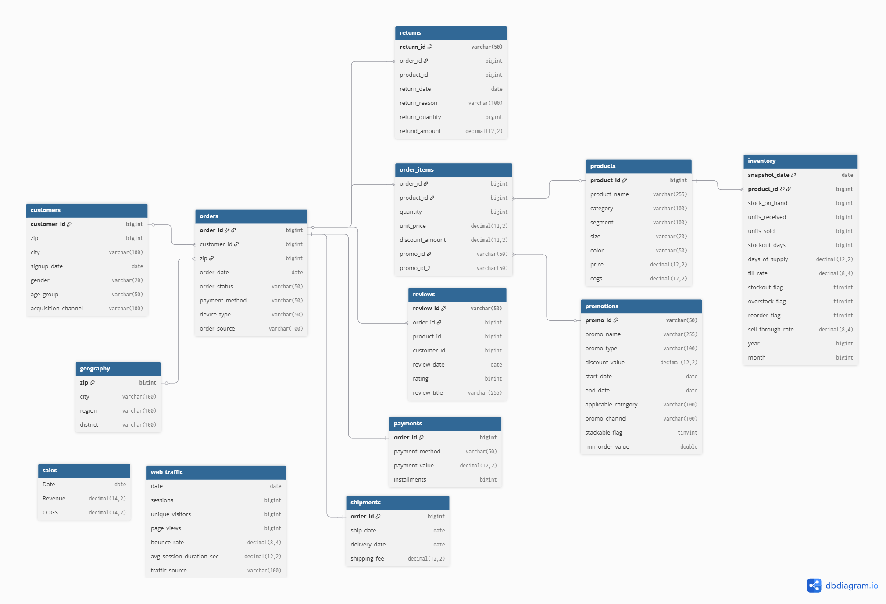

# VinUni Datathon 2026 — Vòng 1

**Team:** claude and em &nbsp;|&nbsp; Lê Huy Tâm · Ngô Nhật Tân · Lê Minh Châu

---

## Source of Truth

- `references/đề_og_btc.pdf` là bản đề cập nhật mới nhất đang có trong repo.
- `dataset/*.csv` là nguồn chuẩn cho tên file, số dòng, cột, và khoảng thời gian dữ liệu thực tế phát hành.
- `report/assets/summary_metrics.json` là metric build lại từ CSV và nên được ưu tiên hơn các con số chép tay trong prose cũ.

Ghi chú: đề gốc vẫn dùng cách gọi `sales_train.csv` / `sales_test.csv` ở một số đoạn. Trong repo này, train series public là `dataset/sales.csv`, còn horizon test public được biểu diễn qua `dataset/sample_submission.csv` với 548 dòng từ `2023-01-01` đến `2024-07-01`.

---

## Nên Xem Gì Trước

| Thứ tự | File | Tại sao |
|--------|------|---------|
| 1 | [`deliverables/round1_report.pdf`](./deliverables/round1_report.pdf) | toàn bộ phân tích, kết quả, methodology trong 4 trang nội dung chính |
| 2 | [`deliverables/submission.csv`](./deliverables/submission.csv) | file nộp Kaggle, 548 dòng, giữ đúng thứ tự `sample_submission.csv` |
| 3 | [`deliverables/mcq_answers.md`](./deliverables/mcq_answers.md) | đáp án Part 1 theo đề cập nhật |
| 4 | [`notebooks/part2_analytics.ipynb`](./notebooks/part2_analytics.ipynb) | notebook chuẩn cho Part 2, là nguồn của các section analytics trong report |
| 5 | [`notebooks/part3_forecasting.ipynb`](./notebooks/part3_forecasting.ipynb) | pipeline Part 3: feature engineering, CV theo thời gian, SHAP, submission |

---

## Sơ Đồ Quan Hệ Bảng



---

## Cấu Trúc Repo

```text
.
├── dataset/                        # 14 file CSV phát hành trong repo, không chỉnh sửa
│   ├── sales.csv                   # train target — 3,833 dòng, 2012-07-04 → 2022-12-31
│   ├── sample_submission.csv       # template submission — 548 dòng, 2023-01-01 → 2024-07-01
│   └── *.csv                       # orders, products, customers, payments, ...
│
├── deliverables/                   # artifacts nộp bài
│   ├── round1_report.pdf
│   ├── submission.csv
│   └── mcq_answers.md
│
├── notebooks/
│   ├── part1_mcq.ipynb
│   ├── part1_data_validation.ipynb
│   ├── part2_analytics.ipynb
│   ├── part3_baseline.ipynb
│   └── part3_forecasting.ipynb
│
├── report/
│   ├── round1_report.tex           # LaTeX source
│   ├── round1_refs.bib
│   ├── round1_report.pdf           # bản build local nếu đã compile
│   └── assets/                     # figures + summary_metrics.json do script generate
│
├── references/
│   ├── đề.md                       # bản markdown đồng bộ từ đề PDF + CSV phát hành
│   ├── đề_og_btc.pdf               # đề cập nhật
│   └── schemas/
│       ├── ddl_simple.sql
│       └── ERD_simple.png
│
└── scripts/
    ├── build_part2_analytics_notebook.py
    └── build_report_assets.py
```

---

## Reproduce

**Cài môi trường**

```bash
pip install -r requirements.txt
```

**Build lại analytics notebook**

```bash
python scripts/build_part2_analytics_notebook.py --overwrite
# -> notebooks/part2_analytics.ipynb
```

**Build lại figures và metric cho report**

```bash
python scripts/build_report_assets.py
# -> report/assets/
```

**Compile lại report PDF**

```bash
cd report
xelatex round1_report.tex
bibtex round1_report
xelatex round1_report.tex
xelatex round1_report.tex
```

---

## Ghi Chú

- Mọi notebook tự tìm repo root nên đọc `dataset/` đúng dù mở từ thư mục nào.
- `part2_analytics.ipynb` là nguồn chuẩn cho Part 2; report chỉ lấy một phần các section trong notebook này.    
- Toàn bộ stochastic operations dùng seed `42`.
